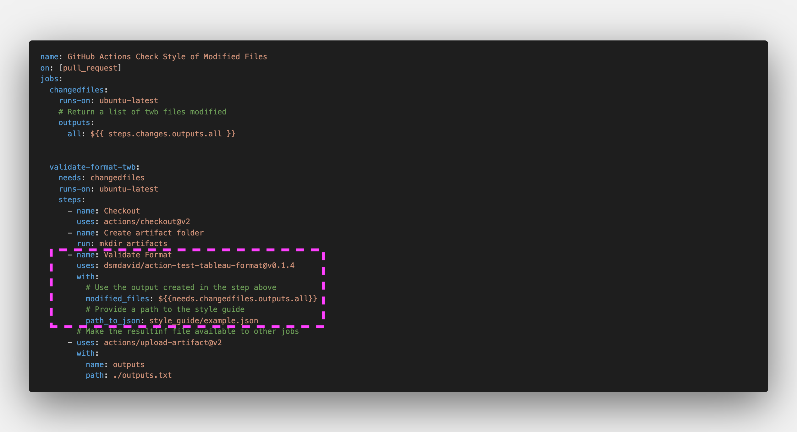

# Tableau format validator - Docker Action

Tests whether a list of twb files conform to a format standard.

Based on: [Brian Crant's tableau style validator](https://github.com/bcrant/tableau-style-validator)

# Requirements:

## modified_files:
A list of files to test (full paths; e.g.: 
    `folder1/myworkbook.twb folder2/myotherworkbook`
## path_to_json:
Path to a file in the repository that contains the style guide. e.g. `style_guide/example_style_guide.json`. See [an example guide style](https://github.com/bcrant/tableau-style-validator/blob/main/tests/example_style_guide.json)
# Outputs:
A file to the root folder of the repo called `outputs.txt`. It can be uploaded using artifacts.
    
# Sample usage:
Create an action in your workflow that uses this one to validate that new/modified workbooks conform to the desired format.

The `outputs.txt` can be used in subsequent jobs (e.g. Slack message)
   
